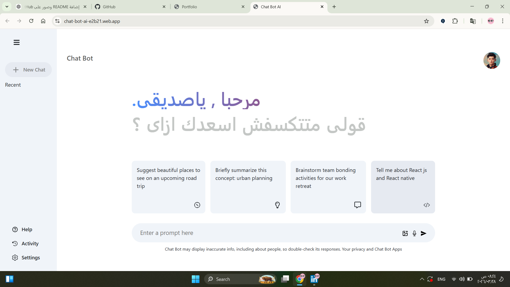
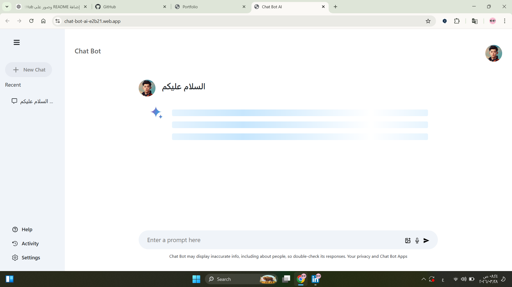

# AI Chat Bot 🤖

A modern AI chat application built using React and powered by Google's Gemini 2.0 Flash model. The app provides a simple and interactive chat experience similar to Google Gemini, focused on text-based conversations.

---

## 📌 Overview

This project is a frontend AI chat application that allows users to send messages and receive intelligent responses using the Google Generative AI API.

It simulates a simplified version of AI assistants like Google Gemini, with a clean UI and smooth user experience.

---

## ✨ Features

* 💬 Real-time AI chat interface
* ⚡ Fast responses using Gemini 2.0 Flash
* 🧠 Smart text-based answers
* 🎨 Clean and responsive UI
* 📦 State management using Redux Toolkit

---

## 🛠️ Technologies Used

* React.js
* Redux Toolkit
* React Bootstrap
* Google Generative AI API
* Gemini 2.0 Flash

---

## 🚀 Live Demo

🔗 https://lnkd.in/drQhKx5r

---

## ⚙️ Getting Started

Clone the repository:

```bash id="t23fjh"
git clone https://github.com/your-username/repo-name.git
```

Install dependencies:

```bash id="k7qx3z"
npm install
```

Run the project:

```bash id="2ix2hm"
npm start
```

---

## 📸 Screenshots


```id="7x1yz4"


```

